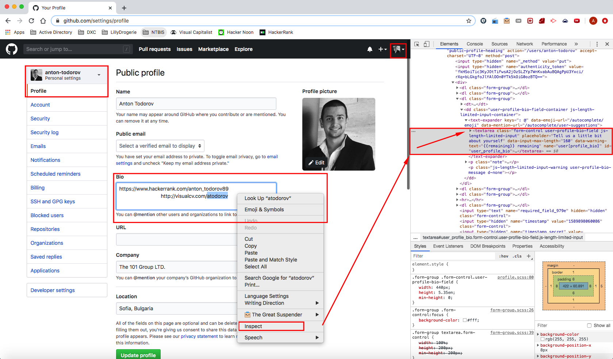

# How To Create Newline In GitHub Bio

## Step 1

Open your Setting page under your Profile and start typing something your want to show in Bio area.

## Step 2

Right click inside the text area and select Inspect option. It will open Developer Tools on your browser and will select the exact area where the text is. 

## Step 3 

Right click on the <text expander> tag and select **Edit as HTML**.

  
## Step 4

Add as many * &nbsp; * as you need in order to push your "new line" forward.

## Step 5

Do an intermediate **Update profile** and open up your profile page to see the results.

## Step 6 

Repeat until desired output format is reachec. 

## Additional notes

Have in mind that the field is auto-resizing in accordance with the browser width.

### References

[Ewfan's *"How-to-create-newline-in-Github-Bio"*](https://github.com/ewfian/How-to-create-newline-in-Github-Bio)
 
[Correct syntax for newline in Github Bio - stackoverflow](https://stackoverflow.com/questions/43406317/correct-syntax-for-newline-in-github-bio)
